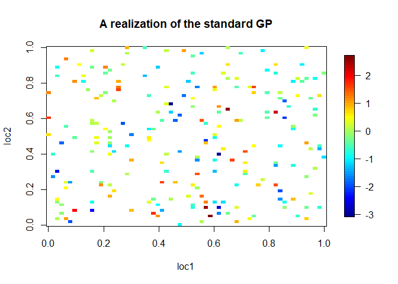

<!-- README.md is generated from README.Rmd. Please edit that file -->

GPsim: An R Package for Simulating Gaussian Processes
=====================================================

The R package `GPsim` is a simulation framework for generating
realizations of both stationary and nonstationary Gaussian Processes
(GPs), which allows users to make use of a wide range of simulation
designs including arbitrary domains and user-defined covariance models.

Installation
------------

``` install
# install.packages("devtools")
devtools::install_github("myeongjong/GPsim")

# # If you need vignettes ...
# install.packages(c("knitr", "formatR"))
# devtools::install_github("myeongjong/GPsim", build_vignettes = T)
```

Example
-------

``` r
library(GPsim)

set.seed(2019)

covparms <- c(1, 0.1, 10)  # (variance, range, degree of anisotropy)

realization <- simulate_gp(locs = "random", n = 15^2, p = 2, meanmodel = function(locs, 
    meanparms) rep(0, nrow(locs)), meanparms = NULL, covmodel = cov_expo_aniso, 
    covparms = covparms, pivot = FALSE, correction = NULL, tol = .Machine$double.eps, 
    seed = 2020)

fields::quilt.plot(realization$locs[, 1], realization$locs[, 2], realization$y, 
    main = "A realization of the standard GP", xlab = "loc1", ylab = "loc2")
```



License
-------

This package is free and open source software, licensed under GPL
(&gt;=2).
